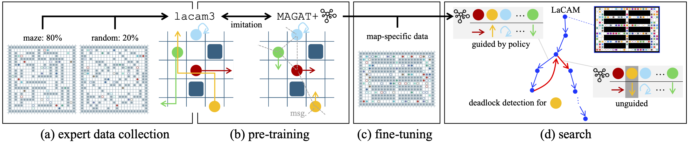
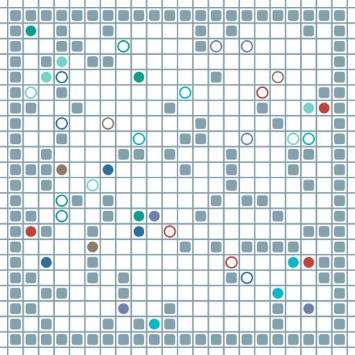
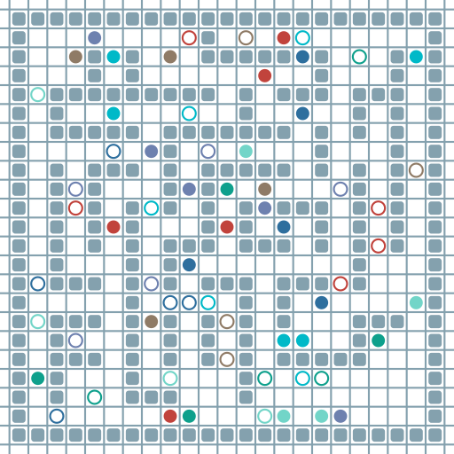
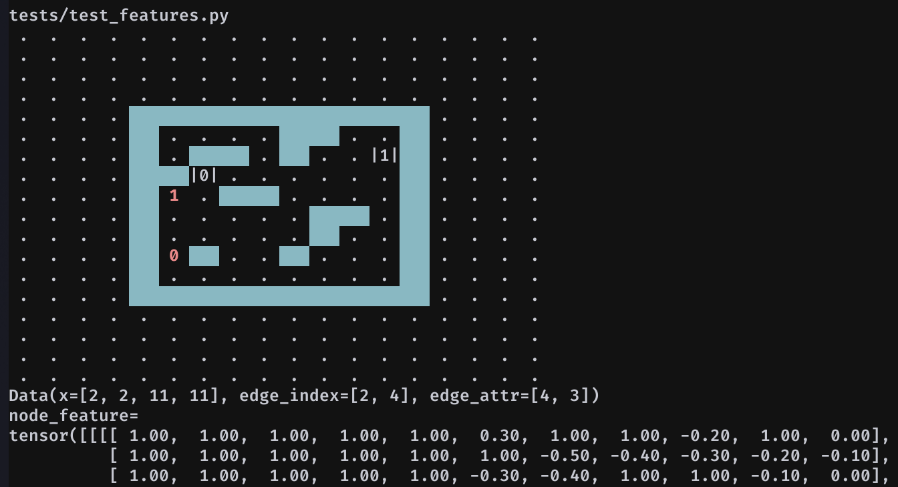
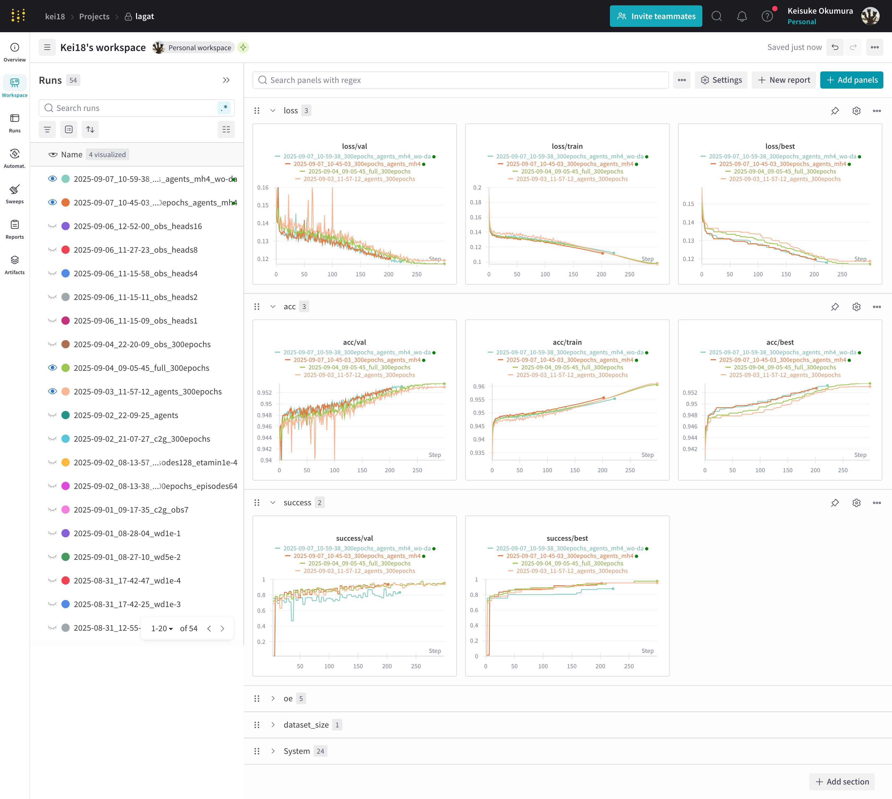
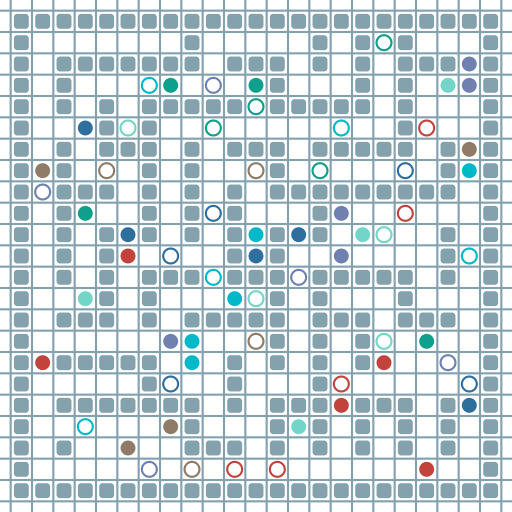
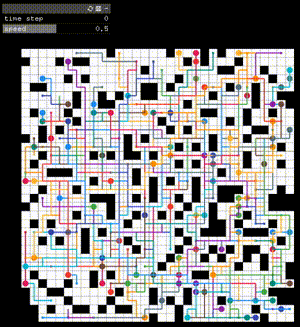
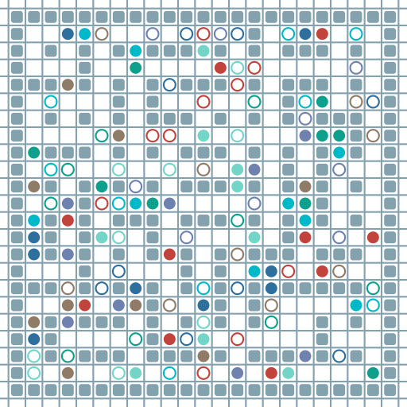

# distill-lagat

[](https://arxiv.org/abs/2510.17382)
[](https://github.com/astral-sh/uv)
[](#)
[](#)
[](LICENSE)
[](https://github.com/Kei18/self-improving-mapf/actions/workflows/ci.yml)

A template implementation for studying imitation learning–based approaches to multi-agent pathfinding (MAPF).
This repository is a __simplified version of [LaGAT](https://arxiv.org/abs/2510.17382)__, a neuro-search method that combines:

- Neural decentralized policy [MAGAT](https://arxiv.org/abs/2011.13219), based on graph neural networks (GNN), implemented with Python 3.10
- Configuration-based search algorithm [LaCAM](https://kei18.github.io/lacam-project/), implemented in C++17



The original LaGAT's code is available on [GitHub](https://github.com/proroklab/lagat) too.

## Requirements

- For GNN training: [uv](https://docs.astral.sh/uv/) for Python packaging
- For LaCAM search: [CMake](https://cmake.org/) (≥v3.16) and [libtorch](https://docs.pytorch.org/docs/stable/cpp_index.html)

See [`.github/workflows/ci.yml`](.github/workflows/ci.yml) for an example Linux CPU build setup, especially for the C++ components.
If available, it is recommended to install a GPU-compatible build of `libtorch` for faster execution.
The C++ artifacts are built into `build/` (e.g., `build/lagat`, `build/lacam3`, `build/interface-lagat`, `build/interface-lacam3`).

<details><summary>libtorch setup on aarch64 (e.g., NVIDIA DGX Spark)</summary>


On aarch64 systems, prebuilt PyTorch / libtorch binaries are not always available.
You need to build PyTorch from source.
Please also refer to the official guide:
https://github.com/pytorch/pytorch?tab=readme-ov-file#from-source

Below is a minimal example for CUDA-enabled builds.

```sh
git clone --recursive https://github.com/pytorch/pytorch
cd pytorch
python3 -m venv .venv/pytorch-src
source .venv/pytorch-src/bin/activate
pip install --group dev
export TORCH_CUDA_ARCH_LIST="12.1" # should be aligned with your system
python3 setup.py develop
export CMAKE_PREFIX_PATH="/path/to/pytorch:$CMAKE_PREFIX_PATH"
```

</details>

## Setup

```sh
git clone --recursive {this repo}
```

After cloning this repo, run the following to complete the Python setup.

```sh
uv sync
```

<details><summary>For CUDA13</summary>

Easy fix:

```sh
uv pip install torch --torch-backend=auto
uv run --no-sync python -c "import torch; print(torch.cuda.is_available())"
```

You need to use `--no-sync` flag every time.
Or, you can add the following lines to `pyproject.toml`.

```toml
[tool.uv.sources]
pogema-toolbox = { git = "https://github.com/Kei18/pogema-toolbox.git" }
torch = { index = "pytorch-cu130" }

[[tool.uv.index]]
name = "pytorch-cu130"
url = "https://download.pytorch.org/whl/cu130"
explicit = true
```

</details>

## Simple demo

Launch Jupyter Lab with

```sh
uv run jupyter lab
```

and open `notebooks/demo.ipynb`.
You can solve MAPF with GNN using the pretrained model stored in `assets/pretrained`.
This will generate the following SVG.



## Used libraries

To make the research easy, the repo uses the following.

- The MAPF environment is with [pogema](https://github.com/Cognitive-AI-Systems/pogema).
- Expert trajectories are generated by [lacam3](https://github.com/Kei18/lacam3).
- GNN is implemented with [PyG](https://github.com/pyg-team/pytorch_geometric)
- The parameter configuration is with [Hydra](https://hydra.cc/).
- Training logging can be monitored with [Weights & Biases](https://github.com/wandb/wandb).

## Directory layout

```
.
├─ src/                       # Python source code
├─ scripts/                   # CLI entry points + build helpers
├─ cpp_planners/              # C++ planners (LaCAM/LaGAT)
├─ assets/                    # maps, pretrained models, demo artifacts
├─ outputs/                   # generated datasets and run outputs
├─ tests/                     # pytest-based checks
└─ build/
   ├─ interface-lacam3/       # Python LaCAM interface shared library
   ├─ interface-lagat/        # Python LaGAT interface shared library
   ├─ lacam3/                 # LaCAM3 planner binary (main)
   └─ lagat/                  # LaGAT planner binary (main)
```


## Workflow

### 1. Generate raw trajectories

The first step is to collect (near-)optimal MAPF solutions, like:



You can do this with:

```sh
uv run scripts/collect_expert_trajectories.py num_samples=10 save_animation=True
```

The results will be stored in `outputs/raw_expert_trajectories`.
Further information on the setups is available using the `--help` argument.

### 2. Translate raw trajectories into dataset

Next, we need to convert the raw data into the PyG format.
Let's first have a look of observation features with:

```sh
uv run pytest -s tests/test_features.py
```

You will get the following output, showing observations used for GNN policies with an observation radius of five:

- node feature (dimension: 2 x 11 x 11): cost-to-go (normalised), locations of other agents
- edge feature (dimension: 3): relative position, Manhattan distance



For the sake of simplicity, the communication radius has been set to the same value as the observation radius.

The above observation dataset, together with labels, is generated as follows:

```sh
uv run scripts/convert_to_imitation_dataset.py dataset_dir=/path/to/dataset/
```

The data will be stored in `outputs/imitation_learning_dataset`.

### 3. Training

We are ready to train the GNN model.
First, let's confirm the model architecture with:

```sh
uv run pytest -s tests/test_model.py
```

The model consists of:
- MLP encoder
- GNN communication module based on GATv2Conv
- MLP decoder

```txt
+--------------------------+------------------+----------------+----------+
| Layer                    | Input Shape      | Output Shape   | #Param   |
|--------------------------+------------------+----------------+----------|
| GNNPlanner               | [2, 2]           | [2, 5]         | 440,197  |
| ├─(encoder)Sequential    | [2, 2, 11, 11]   | [2, 256]       | 128,000  |
| │    └─(0)Flatten        | [2, 2, 11, 11]   | [2, 242]       | --       |
| │    └─(1)Linear         | [2, 242]         | [2, 256]       | 62,208   |
| │    └─(2)ReLU           | [2, 256]         | [2, 256]       | --       |
| │    └─(3)Linear         | [2, 256]         | [2, 256]       | 65,792   |
| │    └─(4)ReLU           | [2, 256]         | [2, 256]       | --       |
| ├─(gnn)GAT               | [2, 256]         | [2, 256]       | 179,328  |
| │    └─(dropout)Dropout  | [2, 64]          | [2, 64]        | --       |
| │    └─(act)ReLU         | [2, 64]          | [2, 64]        | --       |
| │    └─(convs)ModuleList | --               | --             | 179,328  |
| │    │    └─(0)GATv2Conv | [2, 256], [2, 4] | [2, 64]        | 33,216   |
| │    │    └─(1)GATv2Conv | [2, 64], [2, 4]  | [2, 64]        | 8,640    |
| │    │    └─(2)GATv2Conv | [2, 64], [2, 4]  | [2, 256]       | 137,472  |
| │    └─(norms)ModuleList | --               | --             | --       |
| │    │    └─(0)Identity  | [2, 64]          | [2, 64]        | --       |
| │    │    └─(1)Identity  | [2, 64]          | [2, 64]        | --       |
| │    │    └─(2)Identity  | --               | --             | --       |
| ├─(decoder)Sequential    | [2, 256]         | [2, 5]         | 132,869  |
| │    └─(0)Linear         | [2, 256]         | [2, 256]       | 65,792   |
| │    └─(1)ReLU           | [2, 256]         | [2, 256]       | --       |
| │    └─(2)Linear         | [2, 256]         | [2, 256]       | 65,792   |
| │    └─(3)ReLU           | [2, 256]         | [2, 256]       | --       |
| │    └─(4)Linear         | [2, 256]         | [2, 5]         | 1,285    |
+--------------------------+------------------+----------------+----------+.
```

This model is simplified from the original LaGAT, but it works well enough.


The minimal training setup runs as follows:

```sh
uv run scripts/train.py dataset_dir=/path/to/imitation_learning_dataset/ num_epochs=10
```

The results will be stored in `outputs/train`.

With `wandb=true`, Weights & Biases will provide a nice dashboard for training log!



Please check [wandb's Quickstart](https://wandb.ai/quickstart) for the initial setup.
After getting your API key, you can login with:

```sh
uv run wandb login
```

> [!NOTE]
> ##### Memory Efficient Training
>
> `scripts/train.py` loads all tensor data into RAM.
> If the dataset is large, training can become difficult (e.g. 30k instances require approximately 50 GB of memory).
> In such cases, you can use `scripts/train_memory_efficient.py`.
> While training may be slower, this approach allows you to handle much larger datasets.
>
> Empirical data using Nvidia DGX Spark:
> - `train.py`: 84 min for 20 epochs, 4.2 min/epoch
> - `train_memory_efficient.py`: 146 min for 20 epochs, 7.3 min/epoch
>
> ```sh
> uv run scripts/train.py device=cuda dataset_dir=outputs/imitation_learning_dataset/30k dataloader.batch_size=48 num_epochs=20 online_evaluation.use=false
> ```


#### Pretrained model

For the pre-trained model included, I used the following parameters with ~30k instances.

```sh
uv run scripts/train.py \
    wandb=true \
    device=cuda \
    dataset_dir=/path/to/imitation_learning_dataset/ \
    dataloader.batch_size=48 \
    num_epochs=300 \
    online_evaluation.num_samples=500 \
    online_evaluation.dataset_aggregation=True
```

You can also check `assets/pretrained/.hydra/config.yaml`.
The training was with NVIDIA GeForce RTX 2080 Ti, and it took ~35 hours.
The data collection was for a night.

### 4. Simple evaluation

Let's solely evaluate the model performance with:

```sh
uv run scripts/eval_model.py model.fpath=assets/pretrained/success_best.jit save_animation=True
```

This will yield a csv file (some columns are omitted) like:

| index | num\_agents | elapsed\_sec | solved | sum\_of\_costs |  ... |
| ----- | ----------- | ------------ | ------ | -------------- |  --- |
| 0     | 32          | 0.60         | True   | 1372           |      |
| 1     | 24          | 0.28         | True   | 640            |      |
| 2     | 24          | 0.22         | True   | 346            |      |

The results will be stored in `outputs/eval_model`.
The success rate is around 95\%.
Our small GNN planner looks decent.



### 5. Integrate with search

Now, let's integrate the trained GNN policy into the LaCAM search.
The compilation is as follows:

```sh
scripts/build_cpp.sh --planner-lagat
```

Then, run it using the following command:

```sh
build/lagat/main -v 3 \
    -m assets/random-32-32-20.map \
    -o result.txt \
    -N 100 \
    --model assets/pretrained/loss_best_jit.pt
```

Note that it is necessary to use a TorchScript model (`*_jit.pt`).

If you have already installed [kei18@mapf-visualizer](https://github.com/Kei18/mapf-visualizer), you can easily visualise the solution.

```sh
mapf-visualizer assets/random-32-32-20.map ./result.txt
```




### 6. Benchmarking LaGAT

Finally, let's evaluate the planner.
If you need to generate scenarios for benchmarking, you can create MAPF benchmark-style `.scen` files from a map using:

```sh
uv run scripts/generate_mapf_instances.py --map assets/random-32-32-20.map
```

By default, this creates `.scen` files in `outputs/scen`, each containing as many agents as free cells in the map.
Then, the following performs simple benchmarking:

```sh
uv run scripts/eval_solver.py \
    maps=[random-32-32-20,empty-32-32] \
    num_min_agents=100 \
    num_max_agents=200 \
    n_jobs=2
```

You can check the parameters in `scripts/conf/eval_solver.yaml`.

The results will be stored in `outputs/eval_solver`, with a csv file like:

| solver  | num\_agents | map\_name           | scen                          | seed | solved | ... |
| ------- | ----------- | ------------------- | ----------------------------- | ---- | ------ | --- |
| planner | 100         | random-32-32-20.map | random-32-32-20-random-1.scen | 0    | 1      |     |
| planner | 150         | random-32-32-20.map | random-32-32-20-random-1.scen | 0    | 1      |     |
| planner | 200         | random-32-32-20.map | random-32-32-20-random-1.scen | 0    | 1      |     |

(Some columns are omitted.)

## Fine-tuning

The model can be fine-tuned to a specific map by repeating the workflow.
The following is an example for `assets/dense_maze.map`, presented in the original paper.



### 1. Collect raw trajectories

```sh
uv run scripts/collect_expert_trajectories.py \
    grid_config=dense_maze \
    save_animation=True \
    expert.cfg.timeouts=[10,20]
```

### 2. Translate trajectories into dataset

```sh
uv run scripts/convert_to_imitation_dataset.py dataset_dir=/path/to/dataset_dir
```

### 3. Training

```sh
uv run scripts/train.py \
    model=reconstruct \
    model.fpath=assets/pretrained/loss_best.pt \
    grid_config=dense_maze \
    dataset_dir=/path/to/dataset_dir
```

Of course, you need to adjust the parameters!

The trained model example is in `assets/finetuned_dense_maze`.
With 1.5K instances, the training required 5 hours.

### 4. Case study

Using the pre-trained model, LaGAT can solve a dense setup with 128 agents.

```sh
> CUDA_VISIBLE_DEVICES=3 build/lagat/main -v 3 -m assets/dense_maze.map -o result.txt -N 128 -t 30 --model assets/pretrained/loss_best_jit.pt -s 1
elapsed:  5418ms  solved        comp_time_ms: 5406 (wo/model load: 1444ms)      makespan: 99 (lb=33, ub=3)      sum_of_costs: 6583 (lb=1946, ub=3.39)   sum_of_loss: 5329 (lb=1946, ub=2.74)
```

Without model load on GPU, it requires ~1.5s, resulting in solution cost of 3.39 in sum-of-costs.
However, this result is not appealing, given that lacam3 achieves solution cost of 2.9 within 2s.

```sh
> scripts/build_cpp.sh --planner-lacam3
> build/lacam3/main -v 3 -m assets/dense_maze.map -o result.txt -N 128 -t 2 -s 1
elapsed:  2025ms  solved        makespan: 79 (lb=33, ub=2.4)    sum_of_costs: 5625 (lb=1946, ub=2.9)    sum_of_loss: 4869 (lb=1946, ub=2.51)
```

With the fine-tuned model, LaGAT achieves solution cost of 2.36 in 0.6s (excluding model load on GPU).
This outperforms lacam3!

```sh
> CUDA_VISIBLE_DEVICES=3 build/lagat/main -v 3 -m assets/dense_maze.map -o result.txt -N 128 -t 30 --model assets/finetuned_dense_maze/loss_best_jit.pt -s 1
elapsed:  4436ms  solved        comp_time_ms: 4426 (wo/model load: 561ms)       makespan: 66 (lb=33, ub=2)      sum_of_costs: 5774 (lb=1946, ub=2.97)   sum_of_loss: 4578 (lb=1946, ub=2.36)
```

You can play with other setups as well.
But please note that this is a distilled version of the original LaGAT, so its performance is worse.
For example, I could not solve `dense_warehouse` using the default parameters in this repo.

## License

This software is released under the MIT License, see [LICENSE.txt](LICENSE.txt).

## Note

- For the development, I strongly recommend using [pre-commit](https://github.com/pre-commit/pre-commit).
Once installed, it is setup with `pre-commit install`.
- For C++ implementation, the grid maps and scenarios files follow [the MAPF benchmark](https://movingai.com/benchmarks/mapf.html) format.


## Citation

```bibtex
@article{jain2025lagat,
  title={Graph Attention-Guided Search for Dense Multi-Agent Pathfinding},
  author={Rishabh Jain, Keisuke Okumura, Michael Amir, Amanda Prorok},
  year={2025},
  journal={arXiv preprint arxiv:2510.17382}
}
```
